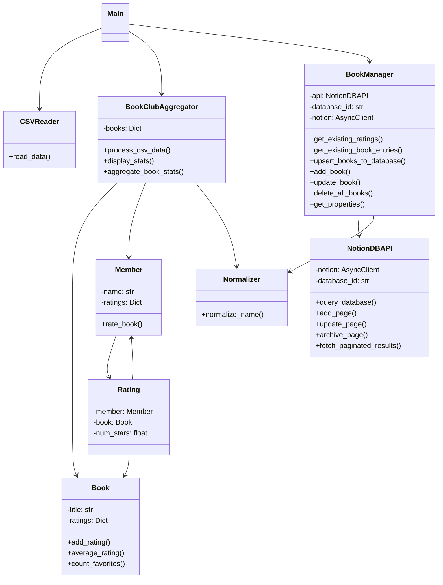

```mermaid
classDiagram
    class Main {
    }

    class BookClubAggregator {
        -books: Dict
        +process_csv_data()
        +display_stats()
        +aggregate_book_stats()
    }

    class BookManager {
        -api: NotionDBAPI
        -database_id: str
        -notion: AsyncClient
        +get_existing_ratings()
        +get_existing_book_entries()
        +upsert_books_to_database()
        +add_book()
        +update_book()
        +delete_all_books()
        +get_properties()
    }

    class Book {
        -title: str
        -ratings: Dict
        +add_rating()
        +average_rating()
        +count_favorites()
    }

    class CSVReader {
        +read_data()
    }

    class Member {
        -name: str
        -ratings: Dict
        +rate_book()
    }

    class Normalizer {
        +normalize_name()
    }

    class NotionDBAPI {
        -notion: AsyncClient
        -database_id: str
        +query_database()
        +add_page()
        +update_page()
        +archive_page()
        +fetch_paginated_results()
    }

    class Rating {
        -member: Member
        -book: Book
        -num_stars: float
    }

    Main --> CSVReader
    Main --> BookClubAggregator
    Main --> BookManager
    BookClubAggregator --> Book
    BookClubAggregator --> Member
    BookClubAggregator --> Normalizer
    BookManager --> NotionDBAPI
    BookManager --> Normalizer
    Member --> Rating
    Rating --> Book
    Rating --> Member
```
